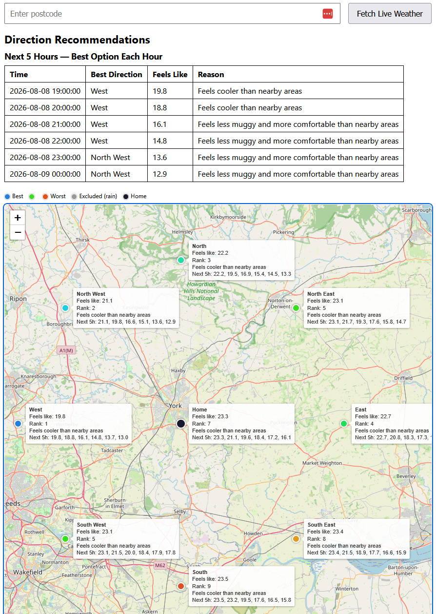

# Comfort Compass

A self-hosted dashboard that recommends which direction to head for a day out
with the dog, based on local weather - comparing home against a ring of
surrounding locations and surfacing whichever feels most comfortable, hour by
hour over the next 6 hours.



I actually use this. It was built for planning days out with my beagle, who is
older and heat-sensitive, so "where is it coolest in the next few hours" is a
genuinely useful question rather than a contrived one. That requirement shaped
the scoring logic more than anything else - see *How the recommendation works*
below.

## Why this project exists

This is a personal learning project built to gain practical, portfolio-worthy
data engineering skills: **Git, dbt, Python, and Docker** - layered on top of
existing strengths in SQL and DAX. The dashboard itself is a vehicle for
learning; the real goal is hands-on experience with the full pipeline below,
deployed for zero recurring cost.

## Architecture

```
[Postcode config] -> [Geocoding] -> [Weather API]
                                       |
                                       v
                    [Raw tables in Postgres] -> [dbt] -> [Scored tables] -> [Flask + Leaflet UI]
```

- Developed on Windows, containerised with Docker, deployed unchanged to a
  dedicated Ubuntu Server box on the home network (a mini PC, replacing an
  earlier Raspberry Pi plan). Running there now, refreshing hourly.
- Config-driven: a postcode setting determines the centre point; a ring of
  8 surrounding locations (+ home) is generated from it, with coastal points
  corrected using postcodes.io's nearest-postcode distance (pulled back to
  the nearest postcode if just offshore, dropped entirely if nothing's
  within 20km).

## Tech stack

| Layer | Choice | Status |
|---|---|---|
| Ingestion | Python (`requests`, `psycopg2`) — geocoding via postcodes.io, weather via Open-Meteo | Built |
| Storage | PostgreSQL | Built |
| Transform | dbt (staging + mart models, tests) | Built |
| Serving | Flask + Leaflet.js (OpenStreetMap tiles) | Built |
| Packaging | Docker + Docker Compose | Built |
| Scheduling | cron, in its own container — hourly refresh alongside the on-demand fetch button | Built |
| Indoor sensor (DHT22) | Raspberry Pi GPIO | **Planned — Phase 2, not built** |
| Historical trend aggregation | dbt models across snapshots | **Planned — data retained, models not built** |

Deployment target is a standard x86_64 mini PC, the same architecture as the
Windows dev machine, so no multi-arch build is needed.

## Project structure

```
ingestion/              # Python: geocode, generate ring, fetch weather, write raw tables
dbt_project/
  models/staging/       # stg_locations, stg_weather_readings - plain passthroughs + schema.yml tests
  models/marts/          # direction_score - scoring logic + schema.yml tests
flask_app/
  app.py                # Queries direction_score + stg_locations, renders the dashboard
  templates/index.html  # Leaflet map (colour-coded markers) + hourly outlook table
docker/
  profiles.yml           # dbt connection config for Docker (env_var()-driven, no secrets)
  ingest-cron             # crontab entry: runs ingest.py hourly
Dockerfile               # Shared image for ingestion/dbt/Flask/cron
docker-compose.yml        # postgres + dbt + flask + cron services
```

## How the recommendation works

The scoring is built around a heat-sensitive older dog, so it deliberately
favours *cooler* conditions rather than "nicer weather" in the usual sense.

Each hour, home's **apparent temperature** ("feels like" - combines real
temperature, humidity and wind) decides a band:

- Above 20°C (**hot**) - rank locations by apparent temperature ascending (coolest-feeling wins)
- 15-20°C (**mild**) - same, apparent temperature ascending (favours least muggy)
- Below 15°C (**cold**) - apparent temperature descending (warmest-feeling wins)

Any location with rain probability over 50% is excluded in the mild/cold
bands (rain doesn't matter when it's hot). The dashboard shows each of the
next 6 hours' top pick separately, since "best during a hot hour" and "best
during a cold hour" aren't comparable on one scale.

Ingestion is snapshot-based and append-only (each run is tagged with a
`snapshot_time`, not overwritten) - the dashboard always reflects whichever
run is most recent, so triggering a live fetch immediately supersedes
whatever was there before. This also means historical data is retained,
laying the groundwork for trend aggregation later.

In the Docker setup, ingestion also runs automatically every hour via a
dedicated `cron` container (`docker/ingest-cron`), on top of the manual
fetch button - so the dashboard stays current without anyone needing to
open it.

## Status

Phase 1 (outdoor-only) is complete and deployed. The full stack — Postgres,
dbt, Flask and hourly cron ingestion — is containerised and running on a
dedicated Ubuntu Server mini PC on the home network, refreshing every hour
unattended.

On that deployment the bundled Postgres service is not used: the stack is
pointed at a shared Postgres instance running alongside other projects on
the same box, via `docker-compose.homelab.yml` (see Deployment below). The
repo's own `docker-compose.yml` is untouched by this, so a fresh clone still
runs completely self-contained.

Not yet built: historical trend aggregation across snapshots (the
append-only ingestion design exists to support it), and the deferred Phase 2
indoor temperature sensor.

## Setup

Both options start the same way:

```
git clone <this repo's URL>
cd Comfort-Compass
```

### Option A: Docker (fastest)

Requires [Docker Desktop](https://www.docker.com/products/docker-desktop/)
installed and running.

1. Copy `.env.example` to `.env` - every value in it already works as-is
   (generic, throwaway `DB_*` credentials for this container-only Postgres
   instance, plus a real London postcode as a placeholder), so this is
   just `cp .env.example .env` with nothing to fill in. Swap `POSTCODE` for
   your own later if you want; everything else can stay untouched. (`DB_HOST`
   gets automatically overridden to `postgres` inside Docker regardless of
   what's in `.env`, since containers reach each other by service name, not
   `localhost`.)
2. `docker compose up --build` - builds the app image, starts Postgres,
   waits for it to be healthy, runs dbt, then starts Flask.
3. Visit `http://localhost:5000`. The database starts empty at first - use
   the postcode field on the dashboard to trigger a live fetch and populate
   it immediately, or just wait; a `cron` container also refreshes the data
   automatically every hour in the background.

### Option B: Manual / local development

Requires Python 3.12, and a Postgres instance to connect to - either a
native install, or reuse the Dockerized one (recommended, one less thing to
install): `docker compose up -d postgres` starts just the database in the
background, with its port mapped to `localhost:5432`, so the rest of this
setup works identically either way.

1. Copy `.env.example` to `.env` and fill in your own values (not
   committed - see `.gitignore`).
2. `python -m venv venv` then activate it, then `pip install -r requirements.txt`.
   Note: dbt-core currently requires Python 3.12 or earlier (not 3.13/3.14)
   due to a dependency (`mashumaro`) compatibility gap.
3. `python ingestion/setup_db.py` - creates the database named in `.env`
   (if missing), both raw tables from `db/init.sql`, and runs `dbt run`.
   Safe to re-run any time; it's idempotent and won't touch existing data.
   Requires a working dbt profile (`~/.dbt/profiles.yml`) pointing at your
   local Postgres - separate from `docker/profiles.yml`, which is Docker-only.
4. `cd flask_app`, `python app.py`, visit `http://127.0.0.1:5000`. The
   database starts empty - use the postcode field on the dashboard to
   trigger a live fetch and populate it, same as the Docker setup. (You can
   also run `python ingestion/ingest.py` directly instead, if you'd rather
   populate it before opening the dashboard at all.)

## Deployment

`docker-compose.yml` is deliberately self-contained: it bundles its own
Postgres, so anyone cloning this repo gets a working system with nothing but
Docker installed. That never changes.

Where this is actually deployed, it runs against a shared Postgres instance
used by several projects on the same server rather than its own bundled one.
That's expressed as a Compose override file rather than by editing the base
config:

```
docker compose -f docker-compose.yml -f docker-compose.homelab.yml up -d --build
```

The override only redirects `DB_HOST`/`DB_PORT` for the `dbt`, `cron` and
`flask` services. This mirrors a normal real-world split — self-contained
repo for local development, shared managed database in production — without
the repo needing to know anything about the environment it lands in.

## Database schema

`db/init.sql` is the single source of truth for the raw table schema. It's
run automatically by Postgres's own `/docker-entrypoint-initdb.d/` init hook
in the Docker setup, and by `ingestion/setup_db.py` in the manual setup -
both paths use the exact same file, so the schema can't drift between them.
`raw_locations` also carries `home_postcode` (which postcode/run a location
row belongs to), `nearest_location_distance` (metres to the nearest real
postcode, used for coastal correction), and `snapshot_time` (which
ingestion run produced it) on both raw tables, supporting the append-only,
multi-run design described above.
